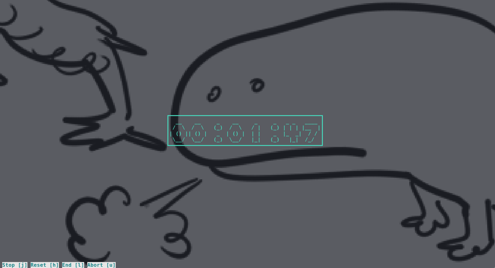
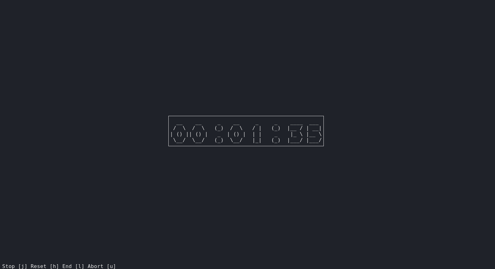
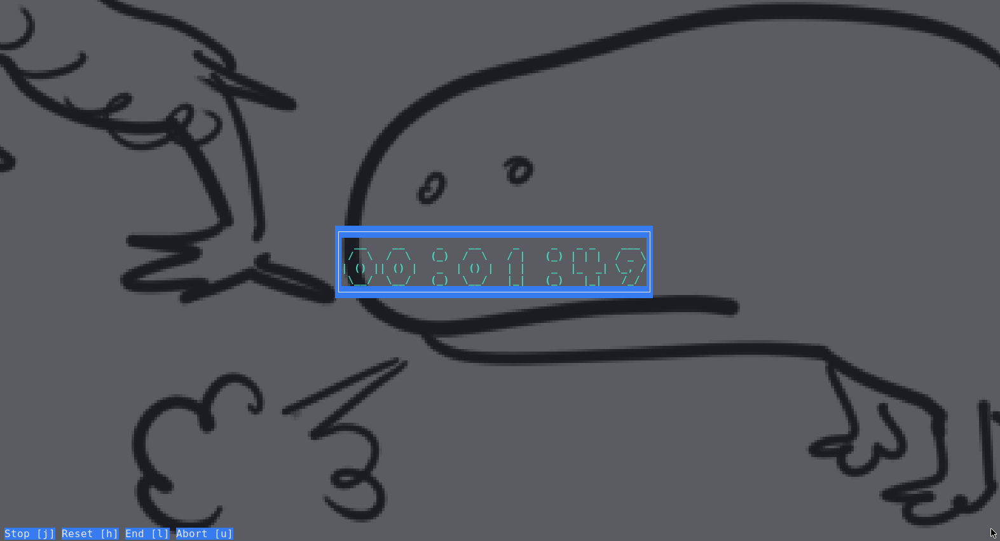
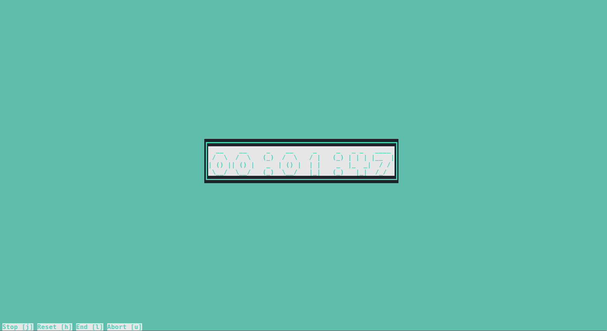

# bsleep
Banner SLEEP

# Building
	$ make

# Configuration
Colors and other console attributes can be suckless™-ly configured through const/config.h.
Some example configurations are included (rename one to "config.h" to use) along side with a template:

